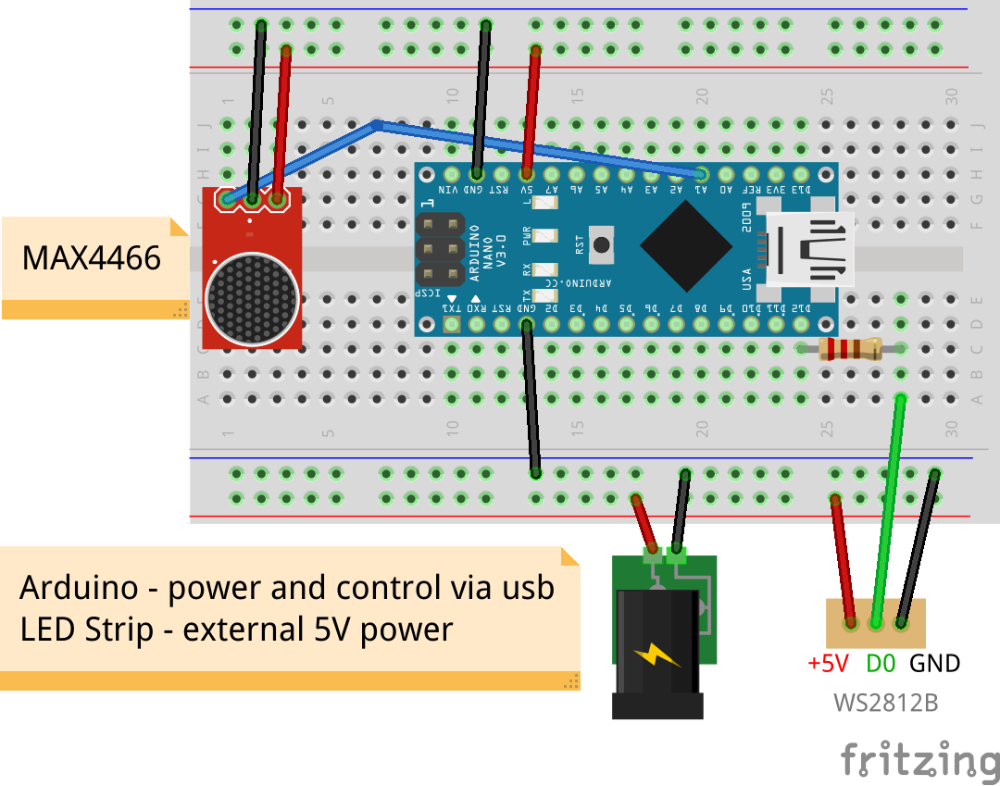

# arduino-led-control

Control LED strip WS2812B (+Music Reactive)

## python app

[tray-led-control](https://github.com/qbbr/tray-led-control)

## schema



## usage

```
 h         - display this help
 v         - print vars (@var: value)
 c <R.G.B> - set color
 m <n>     - set mode
 b <n>     - set brightness
 s <n>     - set speed
 t <0|1>   - enable/disable microphone mode (work only on mode FX_MODE_STATIC = 0)
```
